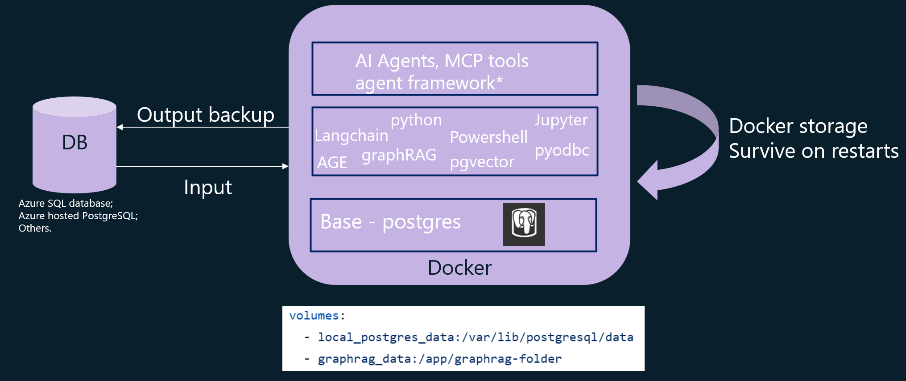

Latest update: March 13, 2026
# GraphRAG and PostgreSQL integration in docker with AGE and AI agents
This solution accelerator is designed to integrate graphRAG and PostgreSQL in a docker, with AGE added and AI agents capabilities on top. This enables Cypher queries, besides graphRAG search, vector search. Even more, AI agents can be built on top to perform advanced tasks by utilizing the rich knowledge graph.

## Background and objectives:
This solution is especially useful when:
- You have raw input data already in a DB.
- You want Cypher query capabilities.
- You prefer CLI version of graphRAG.
- You want to avoid another blob storage between the DB and graphRAG.

## Solution Accelerator Architecture
The solution is to build graphRAG index directly using the data in DB. The docker image uses postgres as base, then added python, graphRAG, AGE, semantic-kernel and other needed packages. With Apache AGE, it enables Cypher queries.
Two volumes are created to persist postgres data and app related data.

## What's new:
1> New graphRAG version 3.0.5. GraphRAG 3.0.5 stabilizes the 3.x configuration‑driven, API‑based architecture and improves indexing reliability, making graph construction more predictable and easier to integrate into real workflows.  

2> Added MCP tools: 
[graphrag_search]: 
    description="Run a GraphRAG query (local or global) with runtime-tunable API params".  
[age_get_schema_cached]:  
    description="Return cached AGE graph schema; if refresh=true, re-query the database and update the cache."  
[age_cypher_query]:  
    description="Execute a user-provided Cypher query against the AGE graph and return rows (each row under key 'result')."  
[age_entity_lookup]:  
    description="Find Entity nodes by name/title substring match (best for 'Who is X?' or quick disambiguation)."  
[age_nl2cypher_query]    
    description="Convert a natural-language question into a Cypher query (Entity/RELATED_TO only), execute it, and return rows; best for complex or multi-hop semantic graph questions."  
    
3> Uses Microsoft agent framework. Multiple scenarios of agents with MCP tools are included in the agent-notebook.ipynb:  

- graphRAG search: local search and global search examples with direct mcp call.  
- graphRAG search: local search and global search examples with agent and include mcp tools.  
- Cypher query in direct mcp call. 
- Agent to query in natural language, and mcp tool included to convert NL2Cypher. 
- Agent with unified mcp ( all five mcp tools), and based on the question route to the corresponding tool. 

**Note:** The repository also includes [age_get_schema] and [age_get_schema_details] MCP tools for debugging and development purposes. These are not exposed to agents by default and are superseded by [age_get_schema_cached] for normal use.

## How to deploy the solution
Please refer to the HOWTO.pdf for detailed steps to deploy the solution:

- [HOWTO.pdf](https://github.com/Azure-Samples/postgreSQL-graphRAG-docker/blob/main/project_folder/HOWTO.pdf)

## Trademark Notice
This project may contain trademarks or logos for projects, products, or services. Authorized use of Microsoft trademarks or logos is subject to and must follow Microsoft’s Trademark & Brand Guidelines. https://www.microsoft.com/en-us/legal/intellectualproperty/trademarks. 
Use of Microsoft trademarks or logos in modified versions of this project must not cause confusion or imply Microsoft sponsorship. Any use of third-party trademarks or logos are subject to those third-party’s policies.

